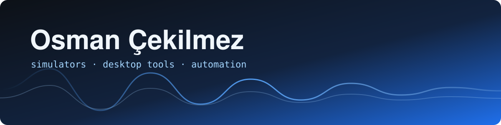

  

# Hi, I'm Osman 👋

I build small tools for things I actually use: circuit simulators, desktop apps, and the automation that keeps my own servers and playlists in order.

🇹🇷 Gerçekten kullandığım şeyler için küçük araçlar yapıyorum: devre simülatörleri, masaüstü uygulamalar, bir de kendi sunucularımı ve çalma listelerimi düzende tutan otomasyonlar.

  
  
  
  
  
  

## Projects · Projeler

| | EN | TR |
|---|---|---|
| 🧮 **[IndyMAT](https://github.com/osmanevski/IndyMAT)** | Local desktop workspace for matrix-based scientific computing, data analysis and plotting with GNU Octave. | GNU Octave ile matris tabanlı bilimsel hesaplama, veri analizi ve grafik için yerel masaüstü ortamı. |
| 🔋 **[Charger-Simulator](https://github.com/osmanevski/Charger-Simulator)** | Battery Lab Simulator — offline bench simulation of a 3S Li-ion CC/CV charger circuit (graduation project). | Battery Lab Simulator — 3S Li-ion CC/CV şarj devresinin çevrimdışı simülasyonu (bitirme projesi). |
| 🖼️ **[PhotoDesk](https://github.com/osmanevski/PhotoDesk)** | Crop and straighten scanned photos and pair them with their handwritten backs. Offline, optional AI. | Taramaları kırp, düzleştir ve yazılı arkalarıyla birleştir. Çevrimdışı, isteğe bağlı yapay zekâ. |
| 📊 **[BeszelBar.VO](https://github.com/osmanevski/BeszelBar.VO)** | A BeszelBar fork that keeps working when the hub is down by reading machines directly over SSH. | Hub çöktüğünde makineleri doğrudan SSH ile okuyarak çalışmaya devam eden BeszelBar çatalı. |
| 🎧 **[music-sync](https://github.com/osmanevski/music-sync)** | Sync Spotify playlists to YouTube Music: incremental sync, Telegram bot control, duplicate cleanup. | Spotify listelerini YouTube Music'e eşitler: artımlı eşitleme, Telegram bot kontrolü, kopya temizliği. |
| 🔎 **[IndyGrab.VO](https://github.com/osmanevski/IndyGrab.VO)** | Serverless Chrome extension for eBay/Amazon product research: finds what sells on eBay and collects matching Amazon ASINs, with optional AI risk checks. | eBay'de satan ürünleri bulup Amazon ASIN havuzuna toplayan, sunucusuz çalışan Chrome eklentisi; isteğe bağlı AI risk kontrolü. |
| 📚 **[KitapRafi](https://github.com/osmanevski/KitapRafi)** | Scroll-animated book showcase site with an admin panel and n8n-driven book intake. | Kaydırma animasyonlu kitap tanıtım sitesi, yönetim paneli ve n8n destekli kitap ekleme otomasyonu. |
| 📺 **[samsung-tv](https://github.com/osmanevski/samsung-tv)** | Samsung Tizen TV remote control and IPTV tools. | Samsung Tizen TV uzaktan kumanda ve IPTV araçları. |
| 🛒 **[sellermind-pro.VO](https://github.com/osmanevski/sellermind-pro.VO)** | AI-assisted customer service and product research assistant for eBay sellers (Chrome extension). | eBay satıcıları için yapay zekâ destekli müşteri hizmetleri ve ürün araştırma asistanı (Chrome uzantısı). |

## Stats

  
  

---

  <a href="https://osmanevski.com">osmanevski.com</a>

